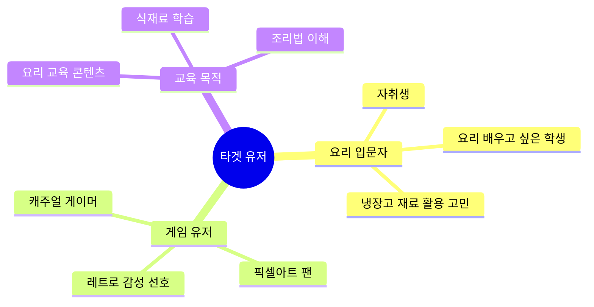
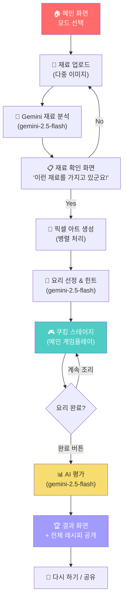
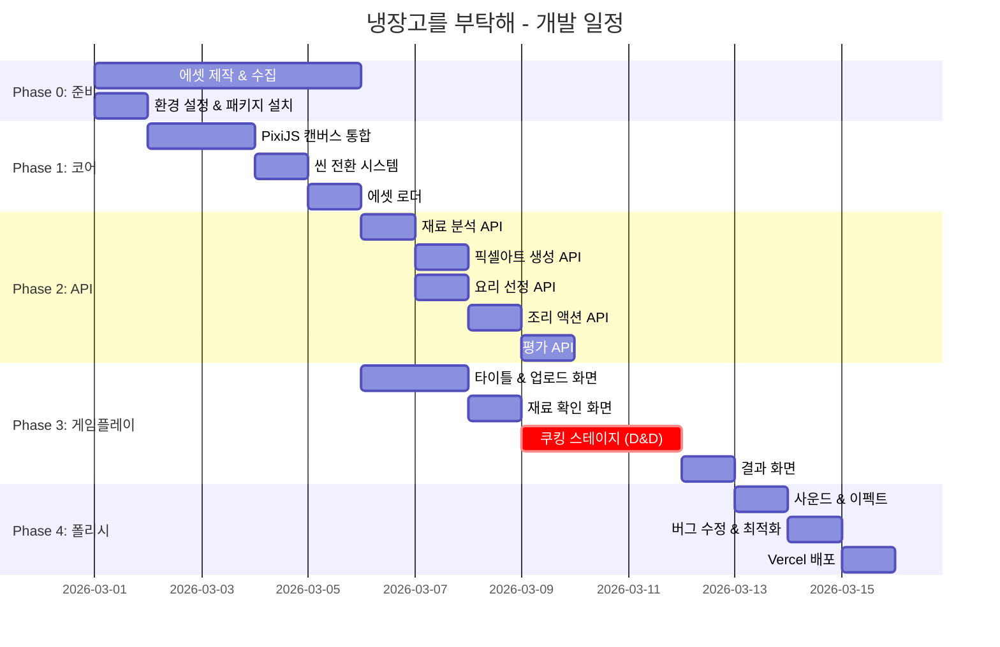

# 🎮 "냉장고를 부탁해(Please, My Fridge!)" — 게임 기획서

> **Pixel Art × AI 요리 게임** | Gemini API 기반 인터랙티브 쿠킹 시뮬레이션
> 
> 작성일: 2026-02-28 | 버전: v1.0

---

## 📋 목차

1. [게임 개요](#1-게임-개요)
2. [핵심 컨셉 & 차별점](#2-핵심-컨셉--차별점)
3. [타겟 유저](#3-타겟-유저)
4. [기술 스택](#4-기술-스택)
5. [게임 플로우 (상세)](#5-게임-플로우-상세)
6. [화면 설계](#6-화면-설계)
7. [Gemini API 프롬프트 설계](#7-gemini-api-프롬프트-설계)
8. [Pre-made 에셋 목록](#8-pre-made-에셋-목록)
9. [프로젝트 구조](#9-프로젝트-구조)
10. [개발 마일스톤](#10-개발-마일스톤)
11. [배포 & 인프라](#11-배포--인프라)
12. [리스크 & 대응](#12-리스크--대응)

---

## 1. 게임 개요

| 항목 | 내용 |
|------|------|
| **게임명** | 냉장고를 부탁해 (Please, My Fridge!) |
| **장르** | AI 인터랙티브 쿠킹 시뮬레이션 |
| **아트 스타일** | 픽셀 아트 (16-bit 레트로 감성) |
| **플랫폼** | 웹 (데스크탑 전용) |
| **플레이 시간** | 1회 약 5~10분 |
| **핵심 기술** | Google Gemini API (이미지 인식 + 텍스트 생성 + 이미지 생성) |

### 한 줄 요약
> 사용자가 실제 냉장고 속 재료 사진을 업로드하면, AI 셰프 **루미(Rumi)**가 재료를 분석하고 요리를 선정합니다. 사용자는 픽셀 아트 주방에서 재료를 조리도구에 드래그하여 요리를 만들고, AI가 최종 평가를 내립니다.

---

## 2. 핵심 컨셉 & 차별점

### 2.1 게임 모드

사용자는 게임 시작 시 **두 가지 모드** 중 하나를 선택합니다:

````carousel
### 🍝 맛있는 음식 모드 (Delicious Mode)
- AI가 **가장 맛있는 정통 레시피**를 선정
- 평가 기준: 정통 조리법과의 일치도
- 힌트: 구체적인 조리 순서 기반
- 톤: "이 재료로 만들 수 있는 최고의 한 끼!"
<!-- slide -->
### 🧪 창의적인 음식 모드 (Creative Mode)
- AI가 **가장 독창적인 퓨전 요리**를 선정
- 평가 기준: 창의적 접근법과의 일치도
- 힌트: 추상적이고 실험적인 힌트
- 톤: "이 재료로 세상에 없던 요리를 만들어볼까?"
````

### 2.2 차별점

| 기존 요리 게임 | 냉장고를 부탁해 |
|---|---|
| 미리 정해진 레시피 | 사용자의 **실제 냉장고 재료** 기반 |
| 정적인 게임플레이 | **AI 실시간 반응** (재료 조합 피드백) |
| 단순 시뮬레이션 | **교육 + 엔터테인먼트** (에듀테인먼트) |
| 고정된 에셋 | **AI 생성 픽셀 아트** 재료 이미지 |

---

## 3. 타겟 유저



- **1차 타겟**: 20~30대 자취생 / 요리 입문자
- **2차 타겟**: 캐주얼 게이머 / 픽셀아트 팬
- **3차 타겟**: 요리 교육 콘텐츠 크리에이터

---

## 4. 기술 스택

### 4.1 프레임워크 선정

| 구분 | 기술 | 선정 사유 |
|------|------|-----------|
| **프론트엔드** | Next.js 16 (App Router) | 기존 프로젝트 기반, SSR/API Routes 활용 |
| **게임 엔진** | **PixiJS v8** | 픽셀 아트 렌더링 최적화, `scaleMode: nearest` 지원, 가벼운 번들 사이즈 |
| **드래그 앤 드롭** | PixiJS Built-in Events | 네이티브 인터랙션 시스템 활용 |
| **AI API** | Google Gemini API (`@google/genai`) | 이미지 인식 + 텍스트 생성 + 이미지 생성 통합 |
| **스타일링** | TailwindCSS v4 (UI 영역) + PixiJS (게임 영역) | 기존 프로젝트 설정 유지 |
| **배포** | Vercel | Next.js 네이티브 지원, 서버리스 API |

> [!IMPORTANT]
> **PixiJS를 선택한 이유**: Phaser는 풀 게임 프레임워크로 강력하지만, 본 프로젝트는 Next.js 내부에 Canvas 게임을 임베딩하는 구조입니다. PixiJS는 **렌더링 엔진**으로서 React 컴포넌트 안에 자연스럽게 통합되며, 픽셀 아트에 필수적인 `nearest-neighbor` 스케일링, `pixelLine` 등의 기능을 세밀하게 제어할 수 있습니다. 번들 사이즈도 Phaser 대비 훨씬 가볍습니다.

### 4.2 Gemini 모델 용도별 배치

| 모델 | 용도 | 응답 시간 목표 |
|------|------|----------------|
| `gemini-2.5-flash` | 재료 이미지 분석 (멀티모달) | ~3초 |
| `gemini-2.0-flash-lite` | 조리 액션 실시간 반응 (텍스트) | < 1초 |
| `gemini-2.5-flash` (이미지 생성) | 재료 픽셀 아트 생성 | ~5초 |
| `gemini-2.5-flash` | 최종 요리 평가 & 레시피 제공 | ~3초 |

---

## 5. 게임 플로우 (상세)



### 5.1 Phase 1: 메인 화면 & 모드 선택

- 픽셀 아트 스타일의 주방 배경
- AI 셰프 캐릭터 **루미(Rumi)** 등장
- 모드 선택: `🍝 맛있는 음식` vs `🧪 창의적인 음식`
- BGM: 레트로 8-bit 스타일 음악

### 5.2 Phase 2: 재료 업로드

- **다중 이미지 업로드** (최대 10장)
  - 냉장고 전체 사진
  - 개별 재료 사진 (양파, 달걀, 파스타 면 등)
- 드래그 앤 드롭 또는 클릭 업로드
- 업로드 시 픽셀 아트 스타일 로딩 애니메이션
- 미리보기 썸네일 표시

### 5.3 Phase 3: 재료 분석 & 확인

**Gemini 처리:**
1. 업로드된 이미지들을 `gemini-2.5-flash`로 분석
2. 식별된 재료 리스트 반환

**화면 출력:**
```
🤖 루미: "오호~ 당신의 냉장고를 살펴봤어!
   이런 재료들을 가지고 있군요:"

   🧅 양파  |  🥚 달걀  |  🍝 파스타 면
   🍅 토마토  |  🐟 생선  |  🧄 마늘

   "맞나요?"

   [ ✅ Yes! ]  [ ❌ No, 다시 분석해줘 ]
```

**Yes 클릭 시 병렬 처리:**
- Task A: 각 재료의 **픽셀 아트 이미지 생성** (`gemini-2.5-flash` 이미지 생성)
- Task B: 선택된 모드에 따른 **요리 선정 + 레시피 생성** (로컬 상태에 저장)

### 5.4 Phase 4: 힌트 제공

```
🤖 루미: "자, 이 재료들로 내가 특별한 요리를 하나 생각해봤어!
   힌트를 줄게..."
   
   💡 힌트 1: "이탈리아에서 온 요리야"
   💡 힌트 2: "토마토가 핵심 소스가 돼"  
   💡 힌트 3: "면 요리인데, 해산물과 잘 어울려"
```

### 5.5 Phase 5: 쿠킹 스테이지 (메인 게임플레이) ⭐

**화면 구성:**
```
┌──────────────────────────────────────────────────────┐
│  [재료 트레이]                    [조리 도구 영역]     │
│  ┌─────────────────┐            ┌──────────────────┐ │
│  │ 🧅 양파          │            │  🔥 화로/스토브   │ │
│  │ 🥚 달걀          │    ──→     │  🔪 도마          │ │
│  │ 🍝 파스타면      │  드래그    │  🍳 프라이팬      │ │
│  │ 🍅 토마토        │            │  🫕 냄비          │ │
│  │ 🐟 생선          │            │  🥣 믹싱볼        │ │
│  │ 🧄 마늘          │            │  🧊 냉장고        │ │
│  └─────────────────┘            └──────────────────┘ │
│                                                      │
│  [조리 결과 영역]                                     │
│  ┌──────────────────────────────────────────────────┐│
│  │  🍝 + 🫕 = "삶은 파스타면" (픽셀 아트)           ││
│  │  🧅 + 🔪 = "다진 양파" (픽셀 아트)               ││
│  └──────────────────────────────────────────────────┘│
│                                                      │
│  [루미 리액션]              [ 🍽️ 요리 완료! ]      │
│  "오! 양파를 먼저 다지다니,                           │
│   좋은 선택이야!"                                    │
└──────────────────────────────────────────────────────┘
```

**핵심 메커니즘:**

1. **드래그 & 드롭**: 재료 픽셀 아트를 조리도구 위로 드래그
2. **즉시 AI 반응** (`gemini-2.0-flash-lite`):
   - 입력: `"양파 + 도마 = ?"` → 출력: `"다진 양파"`
   - 입력: `"파스타면 + 냄비 = ?"` → 출력: `"삶은 파스타면"`
   - 입력: `"달걀 + 프라이팬 = ?"` → 출력: `"스크램블 에그"`
3. **조리 결과 이미지 생성** (가능 시 `gemini-2.5-flash` 이미지 생성):
   - 조리된 중간 재료의 픽셀 아트 이미지를 실시간 생성
   - 생성 실패/지연 시 → 텍스트 + 기본 아이콘으로 대체
4. **루미 리액션**: 각 조리 액션마다 AI 셰프의 한 줄 코멘트
5. **조합 체인**: 중간 결과물도 다시 조리도구에 드래그 가능
   - 예: `다진 양파 + 프라이팬 = 볶은 양파`
   - 예: `삶은 파스타 + 볶은 양파 + 토마토소스 = 양파 토마토 파스타`

### 5.6 Phase 6: 요리 완료 & AI 평가

**"요리 완료!" 버튼 클릭 시:**

1. 사용자의 조리 과정 로그 수집:
   ```json
   {
     "steps": [
       { "action": "양파 + 도마", "result": "다진 양파" },
       { "action": "파스타면 + 냄비", "result": "삶은 파스타면" },
       { "action": "토마토 + 도마", "result": "다진 토마토" },
       { "action": "다진 양파 + 프라이팬", "result": "볶은 양파" },
       { "action": "다진 토마토 + 냄비", "result": "토마토 소스" },
       { "action": "삶은 파스타면 + 토마토 소스", "result": "토마토 파스타" }
     ],
     "finalDish": "토마토 파스타"
   }
   ```

2. Gemini가 **저장된 정답 레시피**와 사용자의 과정을 비교:
   - 일치율 계산 (%)
   - 빠진 단계 분석
   - 순서 적절성 평가

### 5.7 Phase 7: 결과 화면

```
━━━━━━━━━━━━━━━━━━━━━━━━━━━━━━━━━━
        🏆 요리 완료! 🏆
━━━━━━━━━━━━━━━━━━━━━━━━━━━━━━━━━━

  [AI 생성 완성 요리 픽셀 아트]

  🤖 루미: 
  "호호호~ 당신이 만드는 요리, 잘 봤어!
   상당히 비슷하게 만들어서 놀랐어! 😮

   내가 생각했던 요리는 
   '생선을 곁들인 토마토 파스타'였지.

   ✨ 일치율: 87% ✨

   아쉬운 점이라면, 마늘을 먼저 볶아서 
   향을 낸 다음 양파를 넣었으면 더 
   맛있었을 거야!
   
   토마토 파스타를 맛있게 만드려면..."

━━━━━━━━━━━ 전체 레시피 ━━━━━━━━━━━

  1. 마늘을 잘게 다진다
  2. 올리브오일에 마늘을 볶아 향을 낸다
  3. 양파를 잘게 다져 함께 볶는다
  ...

  [ 🔄 다시 하기 ]  [ 📤 공유하기 ]
━━━━━━━━━━━━━━━━━━━━━━━━━━━━━━━━━━
```

---

## 6. 화면 설계

### 6.1 전체 화면 구성 (데스크탑 전용)

```
┌──────────────────────────────────────────────────────────────┐
│                     브라우저 (1280×720 기준)                   │
│  ┌──────────────────────────────────────────────────────────┐│
│  │                    Next.js UI Layer                       ││
│  │  ┌────────────────────────────────────────────────────┐  ││
│  │  │                                                    │  ││
│  │  │              PixiJS Canvas (게임 영역)              │  ││
│  │  │              960 × 540 (16:9)                      │  ││
│  │  │              Pixel Scale: 3x                       │  ││
│  │  │              내부 해상도: 320 × 180                 │  ││
│  │  │                                                    │  ││
│  │  └────────────────────────────────────────────────────┘  ││
│  │                                                          ││
│  │  [UI 버튼/모달은 Next.js/HTML 레이어로 오버레이]          ││
│  └──────────────────────────────────────────────────────────┘│
└──────────────────────────────────────────────────────────────┘
```

### 6.2 화면별 요약

| # | 화면 | 주요 요소 |
|---|------|-----------|
| 1 | 타이틀 화면 | 로고, 모드 선택 버튼, 루미 캐릭터 애니메이션 |
| 2 | 재료 업로드 | 드래그 존, 미리보기 갤러리, 분석 시작 버튼 |
| 3 | 재료 확인 | 식별된 재료 리스트, Yes/No 버튼, 루미 대사 |
| 4 | 로딩/준비 | 픽셀 아트 생성 진행바, 요리 선정 중 애니메이션 |
| 5 | 힌트 화면 | 힌트 텍스트, 루미 애니메이션, "시작!" 버튼 |
| 6 | **쿠킹 스테이지** | 재료 트레이, 조리도구, 결과 영역, 리액션 패널 |
| 7 | 결과 화면 | 완성 요리 이미지, 일치율, 루미 평가, 레시피 |

---

## 7. Gemini API 프롬프트 설계

### 7.1 재료 분석 프롬프트

```
[Model: gemini-2.5-flash]
[Input: 사용자 업로드 이미지 (최대 10장)]

SYSTEM:
당신은 전문 요리사이자 식재료 감별사입니다.
사용자가 제공한 이미지에서 요리에 사용 가능한 식재료를 모두 식별하세요.

RULES:
- 냉장고 전체 사진인 경우, 보이는 모든 식재료를 개별적으로 나열
- 조미료, 양념도 포함 (소금, 후추, 올리브오일 등)
- 식재료가 아닌 것은 제외 (그릇, 비닐백 등)
- JSON 형식으로 응답

OUTPUT FORMAT:
{
  "ingredients": [
    { "name": "양파", "nameEn": "onion", "category": "채소" },
    { "name": "달걀", "nameEn": "egg", "category": "유제품/계란" },
    ...
  ],
  "confidence": 0.92
}
```

### 7.2 픽셀 아트 재료 이미지 생성 프롬프트

```
[Model: gemini-2.5-flash (이미지 생성)]

PROMPT:
"Create a 64x64 pixel art sprite of a [재료명] on a transparent 
background. 16-bit retro game style, clean outlines, vibrant colors. 
The item should be centered and fill about 70% of the canvas. 
Style reference: classic SNES/GBA RPG item icons."
```

### 7.3 요리 선정 & 레시피 생성 프롬프트

```
[Model: gemini-2.5-flash]
[Input: 재료 리스트 + 게임 모드]

SYSTEM:
당신은 {맛있는/창의적인} 요리 전문 셰프입니다.
주어진 재료로 만들 수 있는 {가장 맛있는/가장 독창적인} 요리를 
하나 선정하고, 상세한 레시피를 작성하세요.

INPUT:
- 재료: 양파, 달걀, 파스타면, 토마토, 생선, 마늘
- 모드: 맛있는 음식 (또는 창의적인 음식)

OUTPUT FORMAT:
{
  "dishName": "생선을 곁들인 토마토 파스타",
  "dishNameEn": "Tomato Pasta with Fish",
  "description": "신선한 생선살과 매콤한 토마토 소스가 어우러진...",
  "hints": [
    "이탈리아에서 온 요리야",
    "토마토가 핵심 소스가 돼",
    "면 요리인데, 해산물과 잘 어울려"
  ],
  "recipe": {
    "steps": [
      { "order": 1, "action": "마늘을 잘게 다진다", "tool": "도마", "ingredients": ["마늘"] },
      { "order": 2, "action": "올리브오일에 마늘을 볶아 향을 낸다", "tool": "프라이팬", "ingredients": ["마늘", "올리브오일"] },
      ...
    ],
    "tips": "마늘은 약불에서 천천히 볶아야 탄 맛이 나지 않아요",
    "totalTime": "25분"
  }
}
```

### 7.4 조리 액션 실시간 반응 프롬프트

```
[Model: gemini-2.0-flash-lite]
[목표 응답 시간: < 1초]

SYSTEM:
당신은 요리 게임의 AI입니다. 재료와 조리도구의 조합 결과를 
즉시 알려주세요. 반드시 한국어로 짧게 답하세요.

INPUT: "{재료} + {조리도구}"
예: "양파 + 도마"

OUTPUT FORMAT (JSON):
{
  "result": "다진 양파",
  "resultEn": "chopped onion",
  "reaction": "오! 양파를 먼저 다지다니, 좋은 선택이야!",
  "emoji": "🔪"
}
```

### 7.5 조리 결과 이미지 생성 프롬프트 (선택적)

```
[Model: gemini-2.5-flash (이미지 생성)]
[Best-effort: 실패 시 텍스트로 대체]

PROMPT:
"Create a 64x64 pixel art sprite of [조리 결과물, e.g., 'chopped onion'] 
on a transparent background. 16-bit retro game style, showing the 
processed/cooked state of the ingredient. Clean pixel outlines."
```

### 7.6 최종 평가 프롬프트

```
[Model: gemini-2.5-flash]

SYSTEM:
당신은 친근한 AI 셰프 "루미"입니다. 
정답 레시피와 사용자의 조리 과정을 비교하여 평가해주세요.
게임 캐릭터처럼 재미있고 따뜻한 어투로 말하세요.

INPUT:
- 정답 레시피: {저장된 레시피 JSON}
- 사용자 조리 과정: {사용자 조리 로그 JSON}
- 게임 모드: {맛있는/창의적인}

OUTPUT FORMAT:
{
  "matchRate": 87,
  "evaluation": "호호호~ 당신이 만드는 요리, 잘 봤어! 상당히 비슷하게...",
  "missedSteps": ["마늘을 먼저 볶아 향을 내는 단계"],
  "bonusPoints": ["토마토를 도마에서 다진 것은 정확했어!"],
  "fullRecipeNarrative": "토마토 파스타를 맛있게 만드려면 먼저..."
}
```

---

## 8. Pre-made 에셋 목록

> [!IMPORTANT]
> 아래 에셋은 **개발 전에 미리 제작**해야 하는 항목입니다. AI 생성 에셋(재료 픽셀아트)과 달리, 이 에셋들은 게임의 기본 구동에 필요합니다.

### 8.1 캐릭터 에셋

| 에셋 ID | 이름 | 사이즈 | 프레임 수 | 설명 |
|---------|------|--------|-----------|------|
| `CHR-001` | 루미 idle | 64×64px | 4 | 기본 대기 애니메이션 (살랑살랑) |
| `CHR-002` | 루미 talk | 64×64px | 6 | 대화 중 애니메이션 |
| `CHR-003` | 루미 excited | 64×64px | 4 | 감탄/놀람 리액션 |
| `CHR-004` | 루미 thinking | 64×64px | 4 | 분석/생각 중 애니메이션 |
| `CHR-005` | 루미 cooking | 64×64px | 6 | 요리하는 모션 |

### 8.2 배경 에셋

| 에셋 ID | 이름 | 사이즈 | 설명 |
|---------|------|--------|------|
| `BG-001` | 타이틀 배경 | 320×180px | 픽셀 아트 주방 + 냉장고 (원경) |
| `BG-002` | 쿠킹 스테이지 배경 | 320×180px | 주방 조리대 (근경), 타일 벽, 선반 |
| `BG-003` | 결과 화면 배경 | 320×180px | 접시가 놓인 테이블 (보케 효과) |

### 8.3 조리도구 에셋 ⭐

| 에셋 ID | 이름 | 사이즈 | 프레임 수 | 설명 |
|---------|------|--------|-----------|------|
| `TOOL-001` | 도마 (Cutting Board) | 48×48px | 1 (정적) + 3 (사용 시) | 재료 올리면 썰기 애니메이션 |
| `TOOL-002` | 프라이팬 (Frying Pan) | 48×48px | 1 + 4 | 올리면 지글지글 애니메이션 |
| `TOOL-003` | 냄비 (Pot) | 48×48px | 1 + 4 | 올리면 보글보글 애니메이션 |
| `TOOL-004` | 화로/스토브 (Stove) | 48×48px | 4 (불꽃 루프) | 항시 애니메이션 |
| `TOOL-005` | 믹싱볼 (Mixing Bowl) | 48×48px | 1 + 3 | 올리면 섞기 애니메이션 |
| `TOOL-006` | 오븐 (Oven) | 48×48px | 1 + 3 | 올리면 굽기 애니메이션 |
| `TOOL-007` | 그릴 (Grill) | 48×48px | 1 + 4 | 올리면 굽기 애니메이션 |

### 8.4 UI 에셋

| 에셋 ID | 이름 | 사이즈 | 설명 |
|---------|------|--------|------|
| `UI-001` | 게임 로고 | 200×60px | "냉장고를 부탁해" 픽셀 로고 |
| `UI-002` | 대화 박스 | 280×60px (9-patch) | 루미 대사 표시 영역 |
| `UI-003` | 버튼 (일반) | 80×24px (9-patch) | 기본 버튼 스킨 |
| `UI-004` | 버튼 (강조) | 80×24px (9-patch) | 주요 액션 버튼 스킨 |
| `UI-005` | 재료 트레이 | 100×160px (9-patch) | 재료 아이템 보관 영역 |
| `UI-006` | 결과 트레이 | 200×80px (9-patch) | 조리 결과 표시 영역 |
| `UI-007` | 진행 바 | 120×8px | 로딩/분석 진행률 |
| `UI-008` | 일치율 게이지 | 80×80px | 원형 게이지 (퍼센트 표시) |
| `UI-009` | 모드 선택 카드 | 120×80px ×2 | 맛있는/창의적 모드 선택 패널 |
| `UI-010` | 업로드 영역 | 200×120px | 드래그 존 스킨 |
| `UI-011` | 커서 (일반) | 16×16px | 기본 마우스 커서 |
| `UI-012` | 커서 (잡기) | 16×16px | 재료 드래그 중 커서 |

### 8.5 이펙트 에셋

| 에셋 ID | 이름 | 사이즈 | 프레임 수 | 설명 |
|---------|------|--------|-----------|------|
| `FX-001` | 스팀/김 | 32×32px | 6 | 뜨거운 조리 시 김 이펙트 |
| `FX-002` | 기름 튀김 | 24×24px | 4 | 프라이팬 사용 시 |
| `FX-003` | 칼질 | 32×16px | 3 | 도마 위 썰기 이펙트 |
| `FX-004` | 반짝임 | 16×16px | 4 | 요리 완성 / 성공 시 |
| `FX-005` | 물방울 | 16×16px | 4 | 끓이기 이펙트 |
| `FX-006` | 하트 | 16×16px | 4 | 맛있는 결과 리액션 |

### 8.6 사운드 에셋 (선택 사항)

| 에셋 ID | 이름 | 형식 | 설명 |
|---------|------|------|------|
| `SFX-001` | 칼질 소리 | .mp3/.ogg | 도마 사용 시 |
| `SFX-002` | 지글지글 | .mp3/.ogg | 프라이팬 사용 시 |
| `SFX-003` | 보글보글 | .mp3/.ogg | 냄비 사용 시 |
| `SFX-004` | 드롭 성공 | .mp3/.ogg | 재료 드롭 시 |
| `SFX-005` | 완성 팡파레 | .mp3/.ogg | 요리 완료 시 |
| `SFX-006` | 클릭 | .mp3/.ogg | UI 버튼 클릭 |
| `SFX-007` | BGM (타이틀) | .mp3/.ogg | 메인 화면 루프 BGM |
| `SFX-008` | BGM (쿠킹) | .mp3/.ogg | 게임 플레이 루프 BGM |
| `SFX-009` | BGM (결과) | .mp3/.ogg | 결과 화면 BGM |

### 8.7 에셋 사양 요약

```
📦 에셋 총괄
├── 캐릭터: 5종 (스프라이트 시트)
├── 배경: 3종 (정적 이미지)
├── 조리도구: 7종 (스프라이트 시트)
├── UI 요소: 12종 (9-patch + 정적)
├── 이펙트: 6종 (스프라이트 시트)
├── 사운드: 9종 (선택)
├── 폰트: 1종 (픽셀 폰트, e.g., DungGeunMo)
└── 컬러 팔레트: 32색 제한 팔레트 권장
```

> [!TIP]
> **에셋 제작 도구 추천:**
> - **Aseprite**: 픽셀 아트 & 스프라이트 시트 제작에 최적
> - **Piskel**: 무료 온라인 픽셀 아트 에디터
> - **TexturePacker**: 스프라이트 시트 자동 패킹
> - **sfxr/jsfxr**: 8-bit 사운드 이펙트 생성기
> - **Bosca Ceoil**: 레트로 BGM 작곡 도구

---

## 9. 프로젝트 구조

```
gemini-hackathon-project/
├── app/
│   ├── layout.tsx                    # 루트 레이아웃
│   ├── page.tsx                      # 메인 페이지 (게임 진입점)
│   ├── globals.css                   # 글로벌 스타일
│   │
│   ├── api/                          # API Routes (서버사이드)
│   │   ├── analyze-ingredients/      # 재료 분석 API
│   │   │   └── route.ts
│   │   ├── generate-pixel-art/       # 픽셀아트 생성 API
│   │   │   └── route.ts
│   │   ├── select-recipe/            # 요리 선정 & 레시피 API
│   │   │   └── route.ts
│   │   ├── cooking-action/           # 조리 액션 반응 API (flash-lite)
│   │   │   └── route.ts
│   │   ├── evaluate-cooking/         # 최종 평가 API
│   │   │   └── route.ts
│   │   └── generate-cooking-art/     # 조리 결과 이미지 생성 API
│   │       └── route.ts
│   │
│   └── game/                         # 게임 관련 컴포넌트
│       ├── GameCanvas.tsx            # PixiJS Canvas 래퍼
│       ├── GameManager.ts            # 게임 상태 관리
│       ├── scenes/                   # 게임 씬 (화면)
│       │   ├── TitleScene.ts         # 타이틀 화면
│       │   ├── UploadScene.ts        # 재료 업로드 화면
│       │   ├── ConfirmScene.ts       # 재료 확인 화면
│       │   ├── HintScene.ts          # 힌트 화면
│       │   ├── CookingScene.ts       # 쿠킹 스테이지 (메인)
│       │   └── ResultScene.ts        # 결과 화면
│       ├── sprites/                  # 스프라이트 관리
│       │   ├── Chef.ts              # 루미 캐릭터
│       │   ├── Ingredient.ts        # 재료 스프라이트 (드래그 가능)
│       │   ├── CookingTool.ts       # 조리도구 스프라이트 (드롭 영역)
│       │   └── Effect.ts            # 이펙트 스프라이트
│       ├── ui/                       # 게임 내 UI
│       │   ├── DialogBox.ts         # 대화 박스
│       │   ├── Button.ts            # 게임 내 버튼
│       │   └── ProgressBar.ts       # 진행 바
│       └── utils/                    # 게임 유틸리티
│           ├── AssetLoader.ts       # 에셋 로더
│           ├── DragManager.ts       # 드래그 & 드롭 관리
│           └── SoundManager.ts      # 사운드 관리
│
├── lib/
│   ├── gemini.ts                     # Gemini API 클라이언트 설정
│   └── prompts.ts                    # 프롬프트 템플릿 모음
│
├── public/
│   └── assets/                       # 정적 에셋
│       ├── sprites/                  # 스프라이트 시트
│       │   ├── chef.png             # 루미 스프라이트시트
│       │   ├── tools.png            # 조리도구 스프라이트시트
│       │   ├── effects.png          # 이펙트 스프라이트시트
│       │   └── ui.png               # UI 요소 스프라이트시트
│       ├── backgrounds/              # 배경 이미지
│       │   ├── title-bg.png
│       │   ├── cooking-bg.png
│       │   └── result-bg.png
│       ├── sounds/                   # 사운드 파일
│       │   ├── sfx/
│       │   └── bgm/
│       └── fonts/                    # 픽셀 폰트
│           └── DungGeunMo.woff2
│
├── hooks/                            # React Custom Hooks
│   ├── useGameState.ts              # 게임 상태 훅
│   └── useGemini.ts                 # Gemini API 호출 훅
│
├── types/                            # TypeScript 타입 정의
│   ├── game.ts                      # 게임 관련 타입
│   └── api.ts                       # API 응답 타입
│
├── store/                            # 게임 상태 저장소
│   └── gameStore.ts                 # Zustand 또는 Context 기반
│
├── .env.local                        # 환경 변수 (GEMINI_API_KEY)
├── next.config.ts
├── package.json
└── tsconfig.json
```

---

## 10. 개발 마일스톤



| Phase | 기간 | 핵심 목표 |
|-------|------|-----------|
| **Phase 0** | 1~5일 | 에셋 제작, 개발 환경 구축, 패키지 설치 (PixiJS, Zustand 등) |
| **Phase 1** | 2~4일 | PixiJS 캔버스 통합, 씬 시스템, 에셋 로더 |
| **Phase 2** | 3~5일 | 모든 Gemini API 엔드포인트 구현 & 테스트 |
| **Phase 3** | 4~7일 | 전체 게임 화면 구현 (쿠킹 스테이지 집중) |
| **Phase 4** | 2~3일 | 사운드/이펙트 추가, QA, Vercel 배포 |
| **총합** | **~2~3주** | |

---

## 11. 배포 & 인프라

### 11.1 Vercel 배포 설정

```bash
# 환경 변수 (Vercel Dashboard에서 설정)
GEMINI_API_KEY=your_api_key_here
```

### 11.2 API Rate Limiting 고려

| 엔드포인트 | 예상 호출 빈도 | 대응 |
|-----------|---------------|------|
| 재료 분석 | 게임당 1회 | 일반 |
| 픽셀아트 생성 | 게임당 5~10회 (재료 수) | 병렬 처리 + 에러 핸들링 |
| 요리 선정 | 게임당 1회 | 일반 |
| 조리 액션 | 게임당 10~30회 | **캐싱 + 디바운싱** 필수 |
| 평가 | 게임당 1회 | 일반 |

### 11.3 성능 최적화

- **조리 액션 캐싱**: 동일한 `재료 + 도구` 조합은 캐시하여 재호출 방지
- **이미지 생성 폴백**: 이미지 생성 실패 시 텍스트 + 아이콘 조합으로 대체
- **스프라이트 시트**: 개별 이미지 대신 아틀라스로 묶어 네트워크 요청 감소
- **Serverless 함수 콜드 스타트**: API Routes를 Edge Runtime으로 설정 검토

---

## 12. 리스크 & 대응

| 리스크 | 영향도 | 발생 가능성 | 대응 방안 |
|--------|--------|------------|-----------|
| Gemini 이미지 생성 지연 (>10초) | 🔴 높음 | 🟡 중간 | 로딩 애니메이션 + 타임아웃 시 기본 아이콘 대체 |
| 재료 인식 정확도 낮음 | 🟡 중간 | 🟡 중간 | "No" 재분석 + 수동 재료 추가 기능 |
| `flash-lite` 조리 액션 응답 > 1초 | 🟡 중간 | 🟢 낮음 | 클라이언트 사이드 사전 정의 조합 테이블 폴백 |
| API 비용 초과 | 🔴 높음 | 🟡 중간 | 일일 사용량 제한 + 캐싱 적극 활용 |
| 픽셀아트 생성 품질 불일치 | 🟡 중간 | 🟡 중간 | 프롬프트 튜닝 + 스타일 참조 이미지 제공 |
| Vercel Serverless 타임아웃 (10초) | 🔴 높음 | 🟡 중간 | 스트리밍 응답 + 작업 분할 (이미지 생성은 별도 폴링) |

> [!WARNING]
> **Vercel Hobby 플랜의 Serverless Function 실행 시간은 10초로 제한**됩니다. 이미지 생성 API는 이를 초과할 수 있으므로, Pro 플랜 업그레이드 또는 Edge Runtime + 스트리밍 응답 패턴을 적용해야 합니다.

---

## 부록 A: 컬러 팔레트 제안

32색 제한 팔레트 (픽셀 아트 일관성 유지):

```
주방/배경:  #2b2821, #624c3c, #d9ac8b, #e3cfb4
음식/재료:  #e8595a, #f0a848, #f8d878, #a0e848
          #48b088, #3898d8, #6058d8, #c060a0
채소:      #38b764, #63c74d, #99e550, #e4e8ca
텍스트/UI: #ffffff, #c0cbdc, #8b9bb4, #5a6988
          #3a4466, #262b44, #181425, #000000
효과:      #fee761, #fcab3f, #fc7638, #b33831
보조:      #ffcdab, #d08159, #a05b53, #7b4840
```

---

## 부록 B: 핵심 패키지 목록

```json
{
  "dependencies": {
    "@google/genai": "^1.43.0",
    "next": "16.1.6",
    "react": "19.2.3",
    "react-dom": "19.2.3",
    "pixi.js": "^8.x",
    "@pixi/react": "^8.x",
    "zustand": "^5.x"
  }
}
```

| 패키지 | 용도 |
|--------|------|
| `pixi.js` | 2D 렌더링 엔진 (게임 캔버스) |
| `@pixi/react` | PixiJS의 React 통합 래퍼 |
| `zustand` | 가벼운 상태 관리 (게임 상태) |
| `@google/genai` | Gemini API 클라이언트 (이미 설치됨) |

---

> **Document Version**: v1.0  
> **Last Updated**: 2026-02-28  
> **Status**: 📋 기획 완료 → 개발 대기
